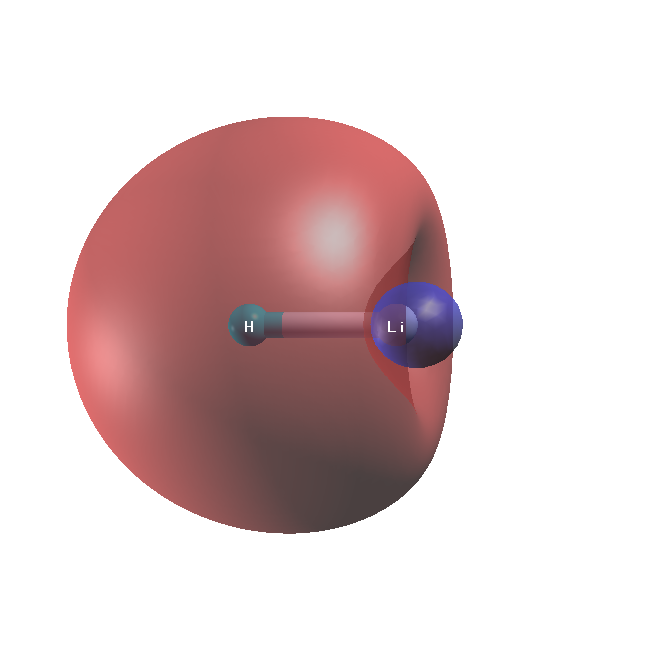
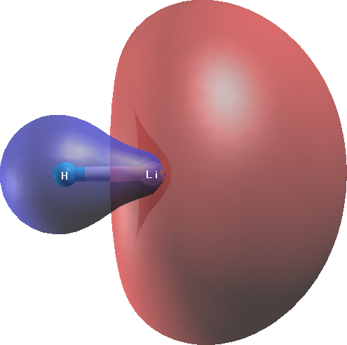

# ffr-LFDFT

NOTE: This is a work in progress.

## Introduction

`ffr-LFDFT` is an experimental package to solve [electronic structure problems](https://en.wikipedia.org/wiki/Electronic_structure)
based on [density functional theory](https://en.wikipedia.org/wiki/Density_functional_theory)
(DFT)
and [Kohn-Sham equations](https://en.wikipedia.org/wiki/Kohn%E2%80%93Sham_equations)
using Lagrange basis functions.

This package is growing from my implementation of Prof. Arias'
[practical DFT mini-course](http://jdftx.org/PracticalDFT.html).
While plane wave is used as the basis set in that course, here Lagrange basis functions
is used as the basis set in this package.

Presently, it can do total energy calculations via SCF and direct minimization.
Force calculations and other types of calculatiosn are planned in the future.

## Requirements

`ffr-LFDFT` is mainly written in Fortran, so a Fortran compiler is required to build
the pakckage.
Currently it has been tested using the following compilers:
- [`gfortran`](https://gcc.gnu.org/fortran/)
- [`g95`](http://www.g95.org)
- [`ifort`](https://software.intel.com/en-us/fortran-compilers)
- [`pgf90`](https://www.pgroup.com/products/community.htm)
- [`sunf95`](http://www.oracle.com/technetwork/server-storage/developerstudio/downloads/index.html)

A C-99 compliant C compiler is also required to compile one external C source file (`Faddeeva.c`).
Recent version of `gcc` should be OK for this.

This repository includes selected `SPARSKIT` files. `SPARSKIT` is used for sparse-matrix vector
multiplication and ILU0 preconditioning. These files are written in FORTRAN77.

This repository also includes
slightly modified `bspline-fortran`.
Recent version of `gfortran` is required to compile this file.

Several numerical libraries are also required:
- BLAS and LAPACK
- FFTW3
- LibXC

## Building the program

To build the program you need to change to directory `src`
```
cd src
```

Copy the appropriate `make.inc` file from directory `platforms`.
For example, you want to use `gfortran`:
```
# execute this command under directory src
cp ../platforms/make.inc.gfortran make.inc
```
You can modify the file `make.inc` to suit your needs.

Finally you can build the program:
```
make           # build the library
make main      # for main executable
make postproc  # for post processing
```

Main executable is named `ffr_LFDFT_<compiler_name>.x`, for example `ffr_LFDFT_gfortran.x`

## Using the program

To use the main program, you need to prepare an input file.
The input file format is very similar to [Quantum ESPRESSO](http://www.quantum-espresso.org/)'s
`pw.x` input. There is no restriction to input file name, as long as it is a valid name.
The following is an example of input file for LiH molecule:
```
&CONTROL
  pseudo_dir = '../../pseudopotentials/pade_gth'
  etot_conv_thr = 1.0d-6
/

&SYSTEM
  ibrav = 8
  nat = 2
  ntyp = 2
  A = 8.46683536902
  B = 8.46683536902
  C = 8.46683536902
  nr1 = 45
  nr2 = 45
  nr3 = 45
  Nstates_extra_ = 1
/

&ELECTRONS
  KS_Solve = 'SCF'
  cg_beta = 'PR'
  electron_maxstep = 150
  mixing_beta = 0.5
  diagonalization = 'LOBPCG'
  startingwfc = 'random'
/

ATOMIC_SPECIES
Li   3.0  Li-q3.gth
H    1.0  H-q1.gth

ATOMIC_POSITIONS angstrom
H     3.48341768451073     4.23341768451073     4.23341768451073
Li    4.98341768451073     4.23341768451073     4.23341768451073
```

Because of its similarity with `pw.x` input, Xcrysden can be used to visualize the
input file. For example, if the filename of input file is

Different from `pw.x` of Quantum ESPRESSO, which by default read input file from
standard input (using redirection `<`), `ffr-LFDFT` reads the name of the input file from
its first argument. The output, however, is printed out to standard output.
The output can be redirected to a file by using `>`.
The following is a typical command to run the program:

```
ffr_LFDFT_gfortran.x INPUT > LOG
```

More examples can be found in `work` directory.

## Post-processing program

One post-processing program, with very limited capability, is also provided.
Currently it only can produce 3D orbital in XSF format which can be visualize
by several visualization programs.






## Development

`ffr-LFDFT` is written in Fortran using modular procedural programming paradigm.
I have tried to avoid to make the code simple enough to read and modify.
In some aspects, the programming style is  similar to the one used in `Elk` code.

Several examples of using the subroutines are given in directory `tests`.
The following code is an example of how to initialize various types of
Lagrange basis functions (sinc, cluster, and periodic)
and the associated the grid points:

```fortran
SUBROUTINE test_sinc()
  IMPLICIT NONE
  INTEGER :: NN(3)
  REAL(8) :: hh(3)

  NN = (/ 63, 63, 63 /)
  hh = (/ 0.3d0, 0.3d0, 0.3d0 /)

  CALL init_LF3d_sinc( NN, hh )
  CALL info_LF3d()
  CALL dealloc_LF3d()
END 

SUBROUTINE test_cluster()
  IMPLICIT NONE
  INTEGER :: NN(3)
  REAL(8) :: AA(3), BB(3)

  NN = (/ 63, 63, 63 /)
  AA = (/ 0.d0, 0.d0, 0.d0 /)
  BB = (/ 16.d0, 16.d0, 16.d0 /)

  CALL init_LF3d_c( NN, AA, BB )
  CALL info_LF3d()
  CALL dealloc_LF3d()
END 

SUBROUTINE test_periodic()
  IMPLICIT NONE
  INTEGER :: NN(3)
  REAL(8) :: AA(3), BB(3)

  NN = (/ 63, 63, 63 /)
  AA = (/ 0.d0, 0.d0, 0.d0 /)
  BB = (/ 16.d0, 16.d0, 16.d0 /)

  CALL init_LF3d_p( NN, AA, BB )
  CALL info_LF3d()
  CALL dealloc_LF3d()
END 

PROGRAM ex_init
  CALL test_periodic()
  CALL test_cluster()
  CALL test_sinc()
END PROGRAM
```

## Useful links

- [Practical DFT mini-course](http://jdftx.org/PracticalDFT.html). A good starting point
  for implementing a DFT code from scratch.

- [KSSOLV](http://crd-legacy.lbl.gov/~chao/KSSOLV/). A MATLAB Toolbox for Solving the Kohn-Sham Equations.
  Another good code for beginner.

- [Quantum Espresson](http://quantum-espresso.org/).

- [ELK DFT package](elk.sourceforge.net/). Various mixing subroutines in SCF are adapted from this package.
